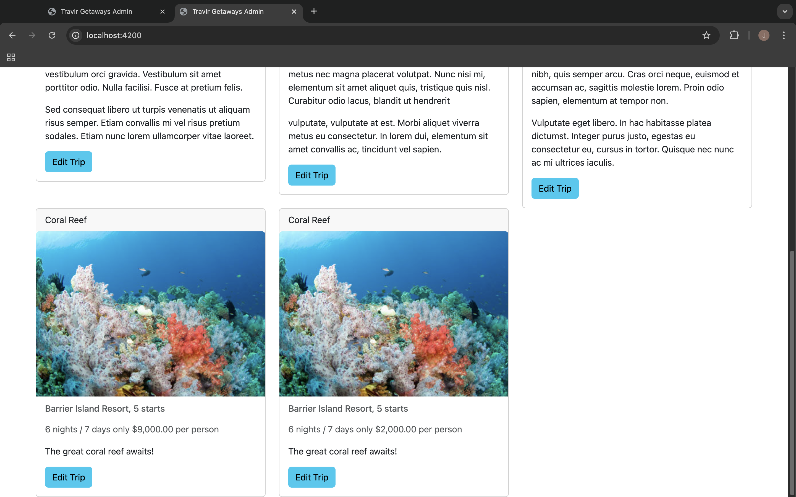
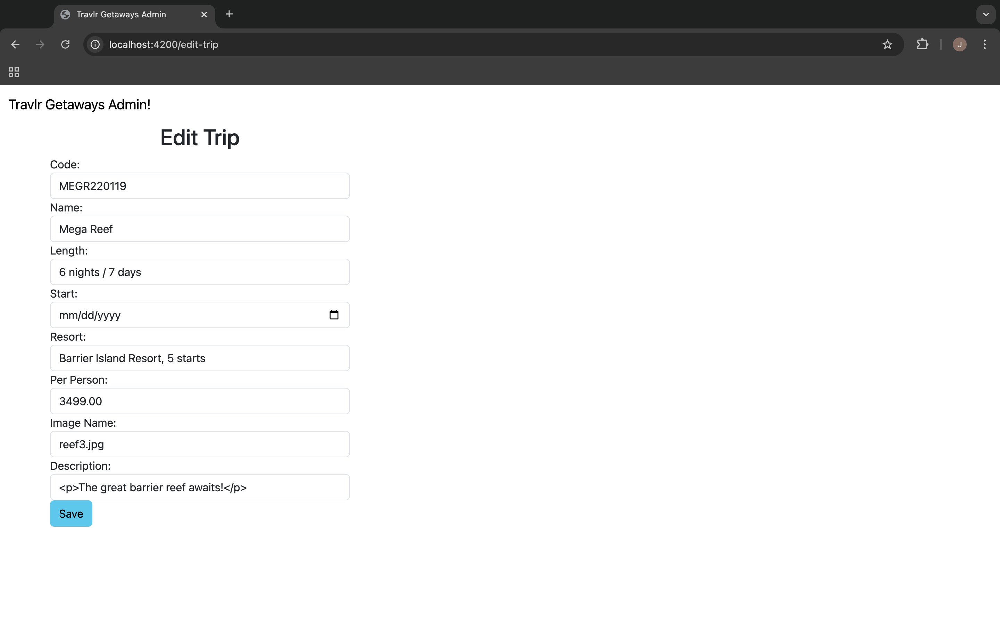
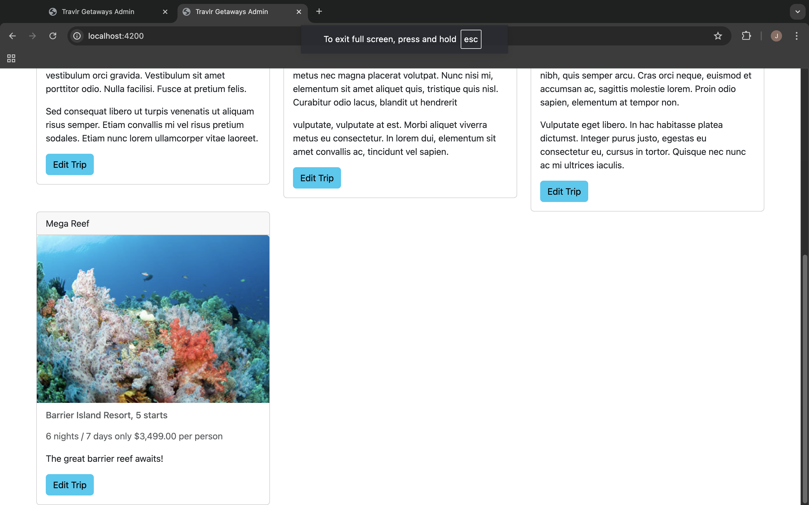

# CS-465
Full Stack Web Application
==========================

Project Overview
----------------

This full stack web application provides functionality for both customers and administrators. The customer-facing side offers an intuitive interface for accessing travel-related content, while the administrative side is a Single Page Application (SPA) that allows secure login and content management. The project integrates security features for admin login authentication to ensure data privacy and secure use.

Architecture
------------

### Frontend Development

The project employs a combination of frontend development approaches, including:

1.  **Handlebars (HBS)**: Used for templating JSON data and rendering dynamic content on the customer-facing side. This lightweight templating engine simplifies the integration of dynamic data into static pages, offering flexibility for straightforward interactions.
2.  **JavaScript**/ **TypeScript**: Provides interactivity and dynamic updates to the HTML content. 
3.  **Single Page Application (SPA)**: The admin side utilizes Angular to create a SPA. This approach offers a smooth, dynamic user experience with faster load times and no full-page reloads, making it ideal for frequent administrative tasks.

  

### Backend and Database

The backend uses Node.js with Express.js to handle API requests and responses efficiently. A NoSQL MongoDB database was chosen for its flexibility and scalability. MongoDB’s schema-less design allows for easy modifications to the data model without disrupting the application, making it well-suited for a project with evolving requirements.

Functionality
-------------

### JSON and Its Role in Full Stack Development

JSON (JavaScript Object Notation) differs from JavaScript in that it is a lightweight data-interchange format used for structuring data. Unlike JavaScript, which includes functions and logic, JSON is strictly for data representation. In this project, JSON serves as the bridge between the front end and back end, enabling seamless communication. For example, the admin SPA sends API requests with JSON payloads to update or retrieve data from the MongoDB database.

  

### Refactoring and Reusability

During development, several instances of refactoring improved functionality and efficiency. For example:

*   Reusable UI components: Angular’s modular structure allowed the creation of reusable components for forms, data, and navigation menus. These components reduced code duplication, simplified maintenance, and improved consistency across the admin interface.
*   Optimized database queries: Refactoring backend API calls to include proper indexing in MongoDB enhanced performance, particularly for endpoints dealing with large datasets.

  

Testing
-------

### API Testing

The project includes robust testing methods to ensure the reliability of API endpoints. Tools like Postman were used to test GET, POST, and PUT, verifying that the application correctly handles requests and responses. For instance:

*   **GET** requests were tested to confirm the retrieval of accurate data for specific endpoints.
*   **POST** and **PUT** methods were tested with various payloads to ensure data was saved or updated correctly.

  

### Security Challenges

Testing endpoints with added security layers presented unique challenges. Admin authentication required testing with valid and invalid credentials to confirm secure access. Methods like token-based authentication were validated to ensure they protected sensitive data while maintaining smooth functionality.

Reflection
----------

This course has been instrumental in advancing my professional goal of becoming a software engineer. I have gained practical experience in full stack development, particularly in:

*   **Frontend and Backend Integration**: Mastering the interaction between Angular, Express.js, and MongoDB.
*   **API Development**: Designing and testing RESTful APIs, which is critical for modern web development.
*   **Security Implementation**: Understanding and applying authentication techniques, making applications more secure and professional.

By learning to build scalable, secure, and user-friendly web applications, I feel more confident building full-stack applications. The skills acquired in this course, such as designing reusable components and efficiently managing data with NoSQL databases, have equipped me with the tools to tackle real-world software challenges.

 

 

 

